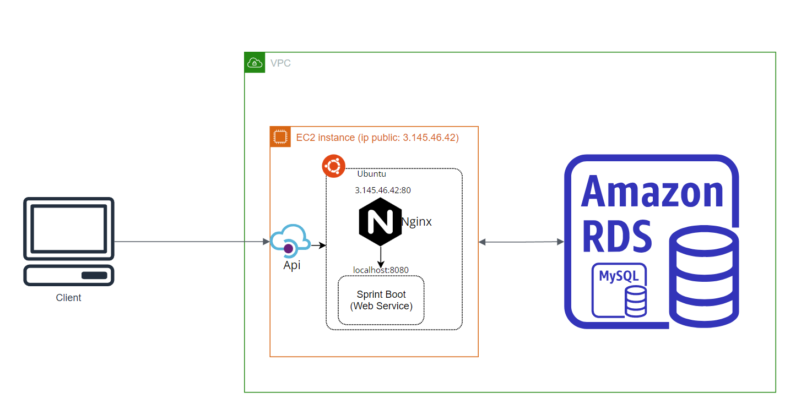

### Requisitos
- Java 17
- Maven 3
- Lombok
- OpenApi

### Despliegue en desarrollo
- Se debe instalar una Bade de datos MySql el local o por defecto di se tiene docker se puede ejecutar el siguiente comando:
  docker run -d --name mysql-container -e MYSQL_ROOT_PASSWORD=admin123 -v dataMySql:/var/lib/mysql -p 3306:3306 mysql:latest --character-set-server=utf8mb4 --collation-server=utf8mb4_unicode_ci --max-connections=1000 --log-bin=binlog --binlog-format=row --server-id=1 --default-authentication-plugin=mysql_native_password

- Una ves con el proyecto en local y el aplication.properties configurado en base a la Base de datos indicada se despliega:
- mvn clean install
- mvn spring-boot:run
- (opcional) java -jar -Dspring.profiles.active=prod -Dserver.port=8080 /{dirección del servicio .jar}

### Test

mvn test

### Open Api

Para ver OpenApi en local http://localhost:8080/swagger-ui/index.html

### Arquitectura producción

Para el despliegue de producción se creó un RDS con una base de datos MySql y una instancia EC2 con una imagen Ubuntu,
a la cual se le instalo un servicio web/Proxy Nginx el cual se encarga de hacer el despliegue y el redireccionamiento

### Estructura de paquetes

